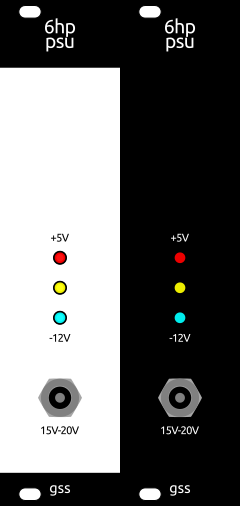

# 6hp psu
6HP Eurorack module

### Render
 

### Input
- 15V-20V
- 2.1/5.5mm Barrel Jack 
- use a *USB PD Trigger Adapter* i.e. to use a power bank

### Output
Without a heatsink
* +5V @ 1.5A
* +12V @ 1A
* -12V @ 1A

Not tested with a heatsink yet. Potentially up to 2..2.5A
per rail! *(Depending on heatsink dimensions and rack depth)*